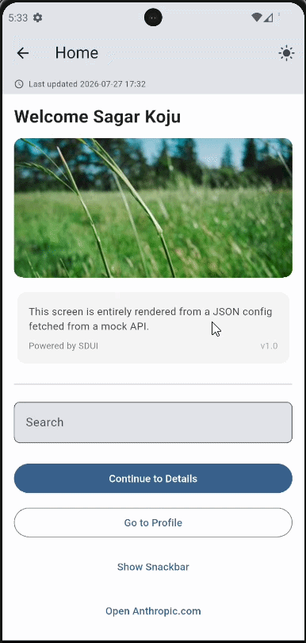

# Server-Driven UI (SDUI) — Flutter Assignment

A Flutter app that renders its entire UI — screens, forms, navigation, and theming — from JSON returned by an API, not from hardcoded widget trees.

---

## 1. Project Setup

**Requirements:** Flutter 3.44+ (Dart 3.12+)

```bash
flutter pub get
flutter run
```

Run tests:

```bash
flutter test
```

No backend server needed — see [Assumptions](#4-assumptions).

---

## 2. Architecture

```
lib/
├── core/                  # Theme, Result type, color/style parsing
├── network/                # ApiClient contract — Dio (real) and Mock implementations
├── models/                # ScreenConfig, WidgetConfig, ActionConfig — JSON parsing layer
├── repositories/           # ScreenRepository — fetches and caches screens
├── state/                  # Riverpod providers (DI root, screen fetch, form state, theme)
├── widgets/
│   ├── renderer/            # WidgetFactory (type → widget), SduiRenderer, ActionHandler
│   └── components/          # One widget per JSON type (text, button, image, ...)
├── screens/                # DynamicScreen — the one screen class used for every route
└── routes/                  # AppRouter — generates routes for any backend route name
```

**Data flow:**

```
Backend JSON
  → ApiClient (network I/O)
  → ScreenRepository (parse, cache, normalize errors → Result<T>)
  → screenConfigProvider (Riverpod async state)
  → DynamicScreen (loading / error / data)
  → SduiRenderer → WidgetFactory → individual Sdui* widgets
```

Each layer only knows the one below it. Any layer can be swapped independently — mock API for a real one, Riverpod for another state manager, one widget for a redesigned one.

### The rendering engine

`WidgetConfig` wraps a widget's raw JSON as typed, null-safe getters (`text`, `action`, `children`, `child`, ...). There's no per-widget-type Dart class — that would mean editing the model every time a widget is added.

`WidgetFactory.build(WidgetConfig)` maps a JSON `type` string to a Flutter widget. **Adding a new widget type takes two steps:**

1. Create `widgets/components/sdui_<name>.dart`
2. Add one `case '<name>':` in `widget_factory.dart`

Nothing else changes. Containers (`column`, `row`, `card`) recurse into `WidgetFactory.build` for their children, so nested trees just work.

### Actions & navigation

Every action (`navigate`, `open_url`, `api_call`, `snackbar`) is an `ActionConfig`, executed by one method: `ActionHandler.execute(...)`. Widgets never contain navigation or API logic themselves.

Navigation is fully backend-driven — `AppRouter.onGenerateRoute` builds a `DynamicScreen` for any route name it receives. New screens need zero client code changes.

### Form validation on submit

Every screen is wrapped in a `Form` (`SduiRenderer`), and each `textfield` renders as a `TextFormField`. One set of JSON rules per field drives two layers of validation:

- **Live, per-field** — once a field is touched, `AutovalidateMode.onUserInteraction` re-checks its format (`email`, `number`) on every keystroke.
- **Whole-form, on submit** — an `api_call` button (e.g. "Save Profile") triggers `Form.of(context).validate()` first, checking every field at once, including ones the user never touched. Anything invalid blocks submission and shows inline errors plus a "Please fix the highlighted fields." snackbar.

A field can require a value independently of its format check via `"required": true`:

```json
{ "type": "textfield", "id": "email", "label": "Email",
  "validator": "email", "required": true }
```

The `"validator": "required"` shorthand still works too. See `test/sdui_textfield_validation_test.dart` for coverage.

### Timestamp validation

Screen configs can include `generatedAt` (ISO 8601, e.g. `"2026-07-27T09:00:00Z"`). `DateValidator` strictly checks the format and rejects malformed strings (`"27/07/2026"`, an out-of-range month/day) — `DateTime.tryParse` alone would silently normalize some of these instead of failing.

A bad or missing timestamp never blocks rendering. `ScreenConfig.hasInvalidTimestamp` just flags it, and `DynamicScreen` shows a small hint banner. The `profile` mock screen ships a deliberately malformed timestamp to demonstrate this; `home` and `details` ship valid ones.

### Error handling

- **Network/parsing errors** → normalized into `ApiException`, then a `Result.failure`. Callers never see raw exceptions.
- **Unknown/missing widget types** → render an inline `SduiErrorWidget` instead of crashing the screen.
- **Missing required properties** (e.g. `text` with no `text` value) → render harmlessly empty instead of throwing.
- **API failures** → retry UI (`DynamicScreen`'s `_ErrorState`); pull-to-refresh available on success too.

---

## 3. Design Decisions

**State management: Riverpod (vs Bloc vs Provider)**

The assignment allowed Bloc, Riverpod, or Provider. Here's the comparison and why Riverpod won for this specific app.

| | **Provider** | **Bloc** | **Riverpod** |
|---|---|---|---|
| Async state per dynamic key (e.g. per route name) | No built-in support — needs manual `FutureBuilder` + caching per screen | Needs a new Event/State/Bloc class per screen | `FutureProvider.family` — built in, zero boilerplate |
| Boilerplate per screen | Low, but grows fast for async + error + loading | High — Event class, State class(es), Bloc class | None — same generic provider reused for every route |
| Reading state outside widgets (e.g. in `ActionHandler`, `ScreenRepository`) | Needs `BuildContext` (`context.read`) — awkward in plain Dart classes | Needs a Bloc instance reference passed around | `Ref` — plain Dart classes read providers with no `BuildContext` |
| Auto cleanup of unused screen state | Manual | Manual (`close()` per Bloc) | `.autoDispose` — automatic |
| Best fit for | Simple, mostly-static app state | A **fixed**, well-known set of complex flows (checkout, auth) | An **open-ended** set of screens sharing one generic fetch/render flow |

**Why not Provider.** It's fine for simple DI and static state, but has no first-class answer for "fetch async data per dynamic key, with loading/error/data states and automatic cleanup." Since the backend can send *any* route name, that logic would have to be hand-rolled per screen. Provider also leans on `BuildContext` to read state, which is awkward inside non-widget classes like `ActionHandler` and `ScreenRepository`.

**Why not Bloc.** Bloc is excellent for complex, event-driven flows with a strict, testable contract — but it wants an Event class, a State class (often several, for loading/loaded/error), and a Bloc class *per screen*. That's a poor fit here: SDUI screens are dynamic and unbounded, so writing a new Bloc every time the backend adds a route doesn't scale. Bloc suits a fixed set of complex flows; this app is the opposite shape — one simple flow (fetch → render) repeated across arbitrarily many screens.

**Why Riverpod.**
- `FutureProvider.family` gives "async state, keyed by route name" for free — `screenConfigProvider('home')` and `screenConfigProvider('profile')` are just two independent, cached instances of the same provider, no custom classes needed.
- `.autoDispose` frees a screen's state automatically once its route is popped, which matters when the backend can describe an unbounded number of screens.
- No `BuildContext` needed to read state — plain Dart classes like `ScreenRepository` and `ActionHandler` depend on providers cleanly via `Ref`/`WidgetRef`. This matters because actions (navigate, API calls) fire from one central, non-widget `ActionHandler`, not from each widget individually.
- Compile-time-safe DI: the `apiClientProvider → screenRepositoryProvider → screenConfigProvider` chain in `screen_providers.dart` is the single composition root. Swapping `MockApiClient` for `DioApiClient` is a one-line change, and everything downstream stays typed and testable with no service locator.
- Maps directly onto the repository pattern already required: the repository returns `Result<ScreenConfig>`, Riverpod watches it, and `AsyncValue.when(loading/error/data)` covers the loading-state and error-handling requirements with no extra plumbing.

In short: Provider is too thin for dynamic async fetching per route, Bloc is too heavyweight for a screen count that isn't fixed at compile time, and Riverpod's `family` + `autoDispose` + context-free reads match the actual shape of an SDUI app — one generic fetch/render flow repeated over an open-ended set of backend-defined screens.

**Mock backend, not a live server**
`MockApiClient` implements the same `ApiClient` interface as `DioApiClient`, returning bundled JSON after a simulated delay. Runs with just `flutter run`, no server, while still exercising the real fetch → parse → cache → render → error pipeline. Switching to a live backend is a one-line change in `screen_providers.dart` (`MockApiClient()` → `DioApiClient(baseUrl: ...)`).

**`Result<T>` instead of throwing across layers**
Forces every caller to explicitly handle both success and failure via `.when(success: ..., failure: ...)`, instead of scattering try/catch through the UI.

**Generic `WidgetConfig`, not one class per widget type**
Trades a little type safety for the scalability the assignment asks for — new widget types with minimal changes.

---

## 4. Assumptions

- No real backend was provided, so `MockApiClient` simulates `GET /screen/{name}` and `POST /action/{name}` from bundled JSON with network-like delay.
- Three example screens — `home`, `details`, `profile` — cover navigation, dynamic forms with validation, and an `api_call` action end-to-end. `profile` also includes one unknown widget type to demo error handling live.
- Backend colors are hex strings (`#RRGGBB` or `#AARRGGBB`); invalid values fall back to the current theme.
- "Dynamic theming" = proper Material light/dark themes (toggleable in the app bar) plus backend-controlled colors on individual widgets — not a full backend-driven theme replacement.

## 5. Bonus Items Implemented

- ✅ Widget/screen caching (in-memory, in `ScreenRepositoryImpl`)
- ✅ Pull-to-refresh
- ✅ Image caching (`cached_network_image`)
- ✅ Unit tests (repository, widget factory, validators)

## 6. Output

🎥 **Demo Video**


<!-- [▶️ Watch Demo](https://github.com/sagarkoju33/hyperce_assignment/blob/main/assets/video/output.mp4) -->
